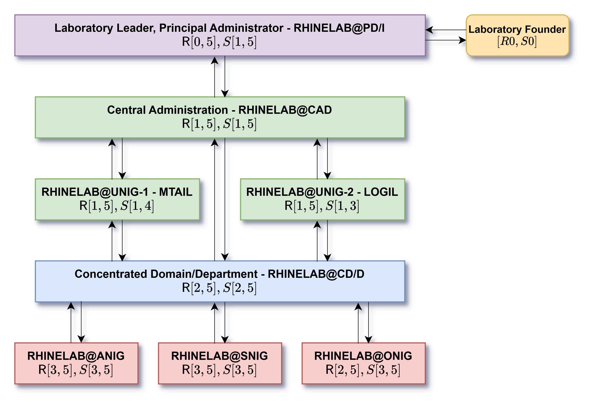

# Chapter 1 - Structure and composition of RHINELAB

We have quite plentiful of people in the laboratory, hence there exists the need to provide a ledger of everyone, and any particular alumni, so to speak, past researcher, and collaborators of the laboratory and institution thereof, both present and future. 

## A. Planning of operational echelon

Scheduling on echelon formation of members for RHINELAB is and would be of the latter sections. The reason for this clarification is as natural as for any working and operating organization of sort, to note that the system is minimal by default, with maybe, perhaps, many role specifications, but a relatively flat hierarchy. While to work under this model we require certain form of hierarchy to delegate, manage and inquire, such logistical constraints and formalism should be gauged and settled under minimality to prevent unnecessary bloat that would, be of superficiality rather than actual function of requirement at present date. We can separate the hierarchy into two parts, either the *Upper Echelon* of system, then the *Lower Echelon* for core members and core specialization. However, their roles, or rather their introduction to the laboratory, is most often considered to be **Tier**, with **Tier One** and **Tier Two** separately for each echelon. 

> [!TIP]
> We use the same word 'Tier' for also the **scope and exercise of power** constraints. Note that those are marked with the statutory tier in Roman numbering, i.e. Tier I, Tier IV and so on. 

Within this system, we expect the following as the minimal digression one can take a glance into, to show and analyze who and what a person inside RHINELAB this particular specimen can be. For example, 

<table>
  <thead>
    <tr>
      <th>Name</th>
      <th>Title</th>
      <th>Subtitle</th>
      <th>Descriptions</th>
      <th>Functional information</th>
      <th>Academic Roles</th>
      <th>Scholastic Roles</th>
      <th>Concentration, Domain, Department, Unit</th>
      <th>Further Note</th>
    </tr>
  </thead>
  <tbody>
    <tr>
      <td>Bui Gia Khanh</td>
      <td>PRD</td>
      <td>DR, DSC, DRC</td>
      <td>Founder of RHINELAB and one of the most active members, as well as architect of many of its projects.</td>
      <td>Like country or something, idk.</td>
      <td>Research Leader</td>
      <td>SMS</td>
      <td>RHINELAB@CAD, RHINELAB@UNIG-01 (MTAIL), RHINELAB@MAPR, RHINELAB@TAAI, RHINELAB@PHILS, RHINELAB@BIO</td>
      <td>None, if there is even some.</td>
    </tr>
  </tbody>
</table>

This will give at most, all details about such person in general. And from there, we are to explain and analyze what each of those mean, and the underlying abbreviation and resolution that is compressed behind them. 

### RHINELAB - Tier One Members

Internally of RHINELAB, we have the following organization of personnel at the top level, that is, the *directorship system* and leadership teams. Insofar, the system itself is provisional, as the system of directorship itself be particularity thereof, with its share of many problems and fallacy.

Within such, we would like to separate the hierarchy into two parts - the *directors*, and the *principle director*, or founder of RHINELAB. Both of them have their places inside the arguably small and compressed system, that would be composing of at least **two tiers** of active directorship - both to ensure direct exposure and not stringent line of control and bureaucratic bloat, but also to separate works evenly, or at least in the attempt of doing so there are. 

<table>
  <thead>
    <tr>
      <th>Title</th>
      <th>Description</th>
      <th>Priority</th>
      <th>Structural Ordering</th>
    </tr>
  </thead>
  <tbody>
    <tr>
      <td><strong>Principle Director</strong> (PRD, also called Laboratory Leader)</td>
      <td>Head of the laboratory and institution a whole, and the absolute apex of operation. Held by the founder of RHINELAB. Is not allowed to resign. Currently held by <strong>Bui Gia Khanh</strong>.</td>
      <td><code>R0</code> to all band of spectrum, if desired.</td>
      <td>Tier I. All decisions on the wider scheme of the laboratory, its operation on the macroscale typically, and microscale under concentrated effort and so on must be approved by the Principle Director.</td>
    </tr>
    <tr>
      <td><strong>Director</strong> (DR)</td>
      <td>This is the role for <em>specialists</em> and often, <em>important scholar of stable and sizable</em> responsibility or qualification. Inside the laboratory, they can be seen as both sizable and good scholar, as well as with organizational, institutional and specific tangential responsibilities toward the culmination and improvement of the laboratory.</td>
      <td><code>R1</code> to <code>R3</code>.</td>
      <td>Inherently, all Tier II. All decision of this tier would be specified down below.</td>
    </tr>
  </tbody>
</table>

Roles of which are active would be marked with the tag `(A)`, and `(P)` for passive, meaning nominally and not-active duty roles, more so observer at that level. Under the directorship system, we can separate it into different archetypes of roles. This is to rather pay respect to each person's archetype and essential preference, for some wanting to handle administrative roles or research on those specifically, or those that would be in charge or of contribution that makes them tangible to diplomats - in such case there will reserve a role in which to gain them more focus and concentration toward that area alone. 

That said, we are also to note the responsibility of the directors. Or rather, the philosophy that the director should pay toward and respect for the members they are managing, and also preparing. While a house without its owner and director is worth not much of the pig cage, a prison is not healthier than what to be of anarchy. So far, our philosophy if *balancing*, in which we lean onto no side yet to acknowledge the leaning of possibility. 

### Directorship Variations

With that in hand, we return our attention to the next identification. Director is not homogeneous. There are, as far as we can consider, many types of director. We will list categories of them here, so free as intended; and they are called **subtitle** for any particular member of RHINELAB, at least in terms of the directorship. 

<table>
  <thead>
    <tr>
      <th>Subtitle</th>
      <th>Description</th>
      <th>Priority</th>
      <th>Structural Ordering</th>
    </tr>
  </thead>
  <tbody>
    <tr>
      <td>Director of Logistics (DR)</td>
      <td>The role belongs to the <em>directorship system</em> of RHINELAB, belongs to the title of what inside the <strong>Core Management Division</strong>, or better known as <strong>RHINELAB Central Administration</strong> (RHINE@CAD), handling different issues about logistical system and organization of the entire laboratory.</td>
      <td><code>R1</code> to <code>R3</code>, based on necessity.</td>
      <td>Tier II. All decisions of this class would be handled surrounding <em>quality of life</em>, moderation concern, deployment of logistics and infrastructure thereof, reorganization of resources and logistical assets, under constraints of the working apparatus and operational tooling, that is, the <em>working team</em> and research community in question. They do not have the order to tangle with <strong>operational team and assets</strong>.</td>
    </tr>
    <tr>
      <td>Director of Science (DSC)</td>
      <td>Fundamentally, this is the role belongs to either <strong>domain experts and mastermind</strong> there be (for example, in DOM@PHYS of physics domain),</td>
      <td><code>R1</code> to <code>R4</code>, with issues and so on regarding scientific research.</td>
      <td>Tier II, similarly so, however they are the actual <em>director on the operational team</em>. Such is then to say they can have the saying and entanglement with functional structures, however, not absolute overriding conditions. This is <strong>mandated of non-absoluteness</strong>, with only weighted voice allowed.</td>
    </tr>
    <tr>
      <td>Director of Functionals (DRC - with custom append for roles)</td>
      <td>The role belongs to the <em>Central Administration</em>, particularly reserved for directors of specialities like <em>outreach director</em>, funding and relation and so on.</td>
      <td><code>R1</code> to <code>R3</code>, based on necessity of unique functionality.</td>
      <td>Tier II, similar to the above. Most of the functionalities are reserved for specialities, so they have no direct route of influence outside of responsibilities upon interaction of laboratories or members.</td>
    </tr>
  </tbody>
</table>

### RHINELAB - Tier Two Members

Tier Two are considered, starting from Half-Member to below, the tier of **guest** (important or passing by), *collaborators*, *temporary members or participants*, and *advisor*. Base on such characterization and description, we can then categorize them into different roles and handling of themselves. On the baseline system, we have **full member** and **half member**, as followed. 

<table>
  <thead>
    <tr>
      <th>Title</th>
      <th>Description</th>
      <th>Priority</th>
      <th>Structural Ordering</th>
    </tr>
  </thead>
  <tbody>
    <tr>
      <td><strong>Full Members</strong> (FM)</td>
      <td>This is the baseline, full and important member of the laboratory. Every person of the laboratory will have, upon the 25-people pool assignment, will be assigned this role, <em>permanently</em>.</td>
      <td><code>R2</code> to <code>R3</code>.</td>
      <td>Fixed on Tier III for operations.</td>
    </tr>
    <tr>
      <td><strong>Half Members</strong> (HM)</td>
      <td>Half member is the <em>almost analogue</em> for <em>trainee</em> or <em>trial participant</em> of the lab's inner circle of sort. There will be inherent <strong>limitation</strong> on what half members can access, based on virtue of trust and accountability. Though it is not as if we are essentially locking them out, we are to build trust with them, and gain their respect (speaking from full member's perspective and the directorship), then we would be entitled to give them access and elevation to full member. It is also expected for the half-member to do the same, if they feel their commitment is <em>worthwhile of consideration</em>.</td>
      <td><code>R4</code>.</td>
      <td>Structural ordering dictates Half Member to be of the lower Tier IV.</td>
    </tr>
    <tr>
      <td><strong>Trainee</strong> (TR)</td>
      <td>Trainees are in identical level of Half Member, but on the majority of their tasks are to be <strong>probing research</strong>, <strong>trial research</strong> and <strong>learning-focused track</strong> rather than research-focused sections. The same limitation applies, as for similar to Half Members, reflected on infrastructures of RHINELAB.</td>
      <td><code>R4</code>.</td>
      <td>Structural ordering dictates Trainee to be of the lower Tier IV.</td>
    </tr>
  </tbody>
</table>

### Academic Roles

Under such, we will have the following set of *mid-level roles and discrete responsibilities*, in such there exists the majority of functionalities under active presumption of RHINELAB institution. Simply speak, team leader, local group leader, and researchers are part of this. This introduces the new concept, **academic priority**. This is different from a priority in administrative term. This, is for *academic activities and coordination* priority upon consideration and arrival. And indeed, there exists also *scholastic evaluation terminology*, of which take into consideration their own innate abilities and given weight inside the laboratory at will. 

<table>
  <thead>
    <tr>
      <th>Title</th>
      <th>Description</th>
      <th>Priority</th>
      <th>Structural Ordering</th>
    </tr>
  </thead>
  <tbody>
    <tr>
      <td>Group/Research Leader</td>
      <td>The role belongs to <strong>research project</strong> or <strong>research group</strong> leading position. Typically assigned for ONIG, SNIG and UNIG groups.</td>
      <td><code>R3</code> on wide-scale of the laboratory.</td>
      <td>Just as stated. Tier III (<strong>Organizer</strong>) of the laboratory. Many of its people would be of this role on administrative side than the above organization thereof, as independent group leader on research.</td>
    </tr>
    <tr>
      <td>Researcher</td>
      <td>This is the <strong>baseline</strong> official member of RHINELAB. In such, they are responsible for their personal research, practical research there be, and so on of activities inside the institution.</td>
      <td><code>R3</code> on the wide-scale of the laboratory. If sufficient, it can be up to <code>R2</code>.</td>
      <td>Just as stated being Tier IV, fully functional <strong>baseline</strong> of the laboratory. Most researcher is classified as such inside the structure of the laboratory, though, they retain structural right and such to perform opinion evaluation and participating on all activities of the laboratory, and advising such.</td>
    </tr>
    <tr>
      <td>Research Trainee</td>
      <td>This is the <em>entry evaluation area</em> where most of the operations on training, accumulating and assessment of sufficient qualification are conducted. It is also where you will land, after applying for the laboratory and under training pipeline.</td>
      <td><code>NA</code></td>
      <td>Nominally Tier V, that said, this role would be where most <em>support on infrastructure</em> would be dedicated of, both in work and so on. So, somewhat closer to Tier IV, with additional credential creation and so on be possible on great scheme for Research Trainee.</td>
    </tr>
  </tbody>
</table>

Those would be the **central core** of what RHINELAB will be consisted of. That is, we are to say the obvious $\mathcal{N}(\sigma,\mu)$ distribution fact - most of the operations and compositions of the laboratory would be of regular members, of the **scholar**, thus they would have to be inquired and taken care of, with grace, and with consideration. 

### Assignment per member

As it stands, *all roles* are to be retained within a particular person promotion, if such can be called under circumstances. That is, if a person stays within the role of which they are assigned beforehand, except of the different place-specific roles then such would be changed accordingly. 

The reason for this system lies in the ability, or at least the deliberation of **academic linage**. A person should retain their *nominal title*, i.e. the title with (P) status. 

### Scope and exercise of power

The scope and exercise of power relies on a system of **tier checking** and **priority code**. While it might seem redundant, it is much more feasible to define this system, instead of patching it up afterward, because of how minimal such system in creation can be. 

## Laboratory compositions

At the current state, the laboratory structure can be said to resemble closed-structure, encapsulation model of the national science entities, and some of the component and organization are taken from the coursebook of the Russian, or the Soviet scientific community at the national level. Given such, it is rather interesting to present the content and thereof, of the accordingly both complex, yet also *simple*, structure of the inquiry itself. 

Based on the structural evolution taken thereof, there is the need to provide laboratory structure, and how everything is formed of the current structure, for clarity and navigation. This document and page is dedicated to explain such. The document is currently managed and maintained in **version Phase I**, i.e. continual update in the realm and domain of Phase I of the coverage of the laboratory. Further specification and information would be added in later version, if such is permitted, under the current form or not given *no information was to be deleted*, such is to only added and requisitioned elsewhere, as noted. 

> [!TIP] 
> As of current, laboratory organization can *only be changed* by Principal Director. 

> [!IMPORTANT]
> Please also refer to `DOC-OR(-PROP)-08` for this specific purpose, and origin of the design template. For many sections of which, documentations would be entirely and is not found in any other record. For the 'record', that is, this site is noted `MNU-OR-02`. 

The laboratory model is inherently *top-down* under influence and ownership. That is, it goes as the following main core central line. 

  

### A. Laboratory Leader, Principal Administrator (`RHINELAB@PD/I`)

The role here is similar to what you would call and usually say as **CEO**, though we should not call it as such. By ownership, the **Laboratory Founder** holds all functional, institutional and correlated, shared *intellectual properties* or private and single-owned intellectual properties or creations. Even though RHINELAB operates on mainly open-source dissection, such inquires non of the require for the work to be non-open-source aside from the mandate that works should be of the ratio $80/15/5$ partition of open-source, semi-open-source and closed-source works and intellectual amounts. The principal administrator here is, of the present tense and all, *Bui Gia Khanh* as also its founder. It is then wise to state, and often better of admission, to say that the Principal Administrator and so far, as its founder, such would not be a role of a manager, but also an active researcher as he is, and is, of a person with his philosophies and so on. He is as much scholar as he is a manager, and should he be, he must then be capable, often time, to realize the balance of which is the human and the logic side of talk. Under such, if the founder and so on of principal administrator is unable to take ahold of such, he would be left with options of suspension of additions on moderations, provisions thereof, and only left of maintenance of RHINELAB, i.e. cold state, meanwhile `RHINE@CAD` would also be suspended of such, however with moderations, provisions, and maintenance level of which does not penetrate the major institutional state suspended of the time, minimally for existence. Until such is resolve, it would be strictly *institutional* and should not penetrate into either the **philosophical pillar** specified universally, or should it be so, of the operational academic activities unless inquired or involved. 

> [!IMPORTANT]
> If the institution and its overreaching system cannot exist under its own philosophy, and much of its survival condition, then, continuity must stop. RHINELAB would cease, by then, of its existence and is replaced of its record. To exist without its own philosophy is not RHINELAB, but another subject in entirety, and should be marked of such per its respect of history and observers therebe."

> [!IMPORTANT]
> Basically, it says if you work with us, you better be damn that you involve us in your credibility of what we do and what we provide, not just financial resources or so but logistics, hosting, and providing your academic working space. We also have saying in your own matter at hand of what you produce inside the laboratory, *will be of the laboratory* but with *you on the record as to influence its usage as the creator and primary researcher or so, if that even applies* in regard to the internal lab, and the external lab usage under constraints settled. Like, licenses and open-source mandate. 

If it is to say about the above implication thereof, extended also to `RHINE@CAD`, then it is simple. We *fear* loss of open-control, but more so the fear of **historical erasure**. In a sense, you cannot remove those of which to give you spoon that you feed your meal in. Your contributions, creations, and thereof, either of the lone genius taken in, or a rogue one in rebellion, are not, in any sense, capable of inventing anything alone. The myth of the lone genius is not **real** nor it is **practical**, for it, to rely on its own sustainability, be it parents, be it teachers, of the benevolent people of which is very rare and even in such a case, such would be of rhetorically despicable to remove such teacher from ever being credited for even helping the person following him. If such person is to be alone, truly alone, then he must fend for himself, eat for himself, make everything of himself, of theoretical visions, of which to enquire no intellectual palace to stand, the room to think, bored of hunger, bored of bureaucrats, constrained by resources, lack of times. All of such, are not alone, and should, under least condition, be recognised of such. In position of the adversarial from such, is perhaps quite so, the act of naivety, irresponsibility, treacherous removal of identity and existence under either normal or philosophical mention, and simply against everything scientific discourse and existence of even the action of science is for, if we take it more than just mainstream to extend very close to the term *philosophy* there is.  

## B. Central Administration (RHINE@CAD)
Often abbreviated as *RHINE@CAD* (or so just for everything of *RHINELAB@* in syntax), the *central administration* is the *core structural* system that is of use for RHINELAB and its operational strength. 

The function of CAD is varied, but often times of such, it maintains the larger: 
1. Functional and autonomous, generalized and compartmentalized *logistical system* and *institutional generation system* used for RHINELAB's intellectual activities. 
2. Principles and theoreticals on matters concerning RHINELAB's operations, laboratory operations, and the *scientific theories* in general. 
3. Institutional research, i.e. the research on *institution, systems of intellectual activities and humanitarian concentration* [^1] [^2]. 
4. Maintenances and bookkeeping, operational reduction, in general institutional building and recheck. 
5. Maintain research on *fundamental science* and *network system control*. 

Those are some of the core operational 1s and tasks that CAD should take into account alongside their own philosophy. Role assignments follows, with its core the *Administrator* of CAD in its core, which can be of at most four seats. One seat is permanently occupied by the Principal Administrator [^3]. Planning and general macro-structures are **not permitted to be changed** by any members of `CAD`, aside from major consensus and Principal Administrator's agreement. This is not a democracy, you know. 

Under the composition of `RHINE@CAD`, there then exists three, with the included third in development at the time of writing this (of a plan to finish formation theoretical by 2027), listed in [[UNIG - Named Laboratory]], of classification **UNIG**. 
### UNIG-01, MTAIL (Modelling Theory, Artificial Intelligence and Learning-theoretic Laboratory)
The unit `RHINE@MTAIL`, focused on *modelling theory*, general *artificial intelligence*r research of both theoretical and philosophy, and learning-theoretic development such as *symbolic learning theory* and *statistical learning theory*, or *alternative learning theory* at such. Their work focuses on, for now, hinges on:
1. Theory of modelling, reformation and reclassification of models and their **importance order**. 
2. Artificial intelligence and its theoretical treatments, applied AI system analysis. Specifically *negative research* against AI developments. 
3. *Learning theory*, including **statistical learning theory** and *symbolic learning theory* (1950s-1990s) as its central study. 

Majority of all works from `RHINE@MTAIL` is impervious of the **core work and research** of the lab. Thus, it takes absolute precedence over all else when it comes to academic research and core functional. 
### UNIG-02, LOGIT (Logistics, Operational and General Infrastructure, Template Laboratory)
Logistic branch of the `UNIG` system. They handle the *theory of institutional logistics* and the *theory of human and scholastic logistics*, and maintenance of RHINELAB's logistical system. Their capacities define *how much can they extend* of the laboratory, at any given time. 
### UNIG-03, GTPR (General Theoretical and Principal Resolution Laboratory)
They are the *general theoretical research branch*. This ranges from *institutional theory* research, *functional laboratory research*, template of the institutional and various form of operational core, code of conduct, communication protocol in academic research, philosophical grounding and debate on institutional workings, and more of non-institutional works, for example, *philosophy of science* and *philosophy of scientific research*, and so on. This group is currently *non-operational*.
## C. Concentrated Domains and Departments (RHINE@CD/D)
This organization is one-step lower than the previous one. The philosophy here is rather, no pun intended, *concentrated*, and much of it relies on a new concept that we called as the *concentration of knowledge* fields. 

[^1]: Here, humanitarian concentration strictly means, not extended to otherwise, *human-centric configuration and assessment* of a particular activity hub in which human-to-human interaction is classified as *high-intensity*, and as also there exists both polar of the *separability condition*, and *humanizing condition*. 

[^2]: As above stated of the first footnote, clarification of such should be delivered in the same time. By *high-intensity classification*, we believe that intellectual community, research laboratory, and many of the institutional system of **scholastic nature**, resides intrinsic non-collapsible and often time natural *identity interaction*, between identities of humans, different people and their own archetype, so much so also the oppositions thereof. In doing so, institutional system faces two calamities thereof - either would they switch to *separability conjecturation* where one would conjecture and actionalize on *separation of identity from functions*, to preserve their oppositions and of which identity, intellectual mass in which they define as of their worldview, material view, and existential view. On the other side, such would be enquired of the opposition to those being *humanization conjecturation*, where one goes for *humanizing the system*, enforcing identity extension, acknowledgement of identities baseline, basis, and what to form of the institution to replicate of which fundamentally human-qualities like empathy, facilitation on analytical viewport of emotional response, irreducible stance on the analytic of human as quantification or categorization (such as, for example, psychological diseases as a total proxy for erratic behaviours), and communal preference. Such would be the gauging thereof that is required of which CAD would have to put theoretical, and to put practical into effect.  

[^3]: The design here is particularly pointed to a system of *delegated control*. By default, while exercising power of the Principal Administrator waives under structural condition of any pushback from the below system, such would be not preferable for natively solvable solutions. Under administrative works and the meta-linguistic thereof for the laboratory system, should it be inquired, the Principal Administrator, and thus subsequently, administrative personnel, shall exercise *local enforcement condition*, if available (which should be made available of all time) unless required under assessment otherwise, to not exercise abundance of administrative power where such is not necessitated of the preliminary conditions. 

